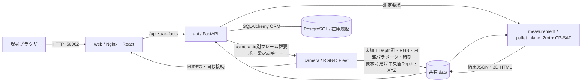
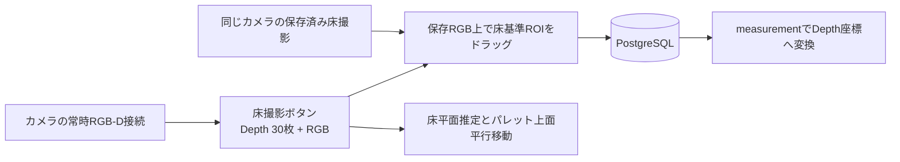
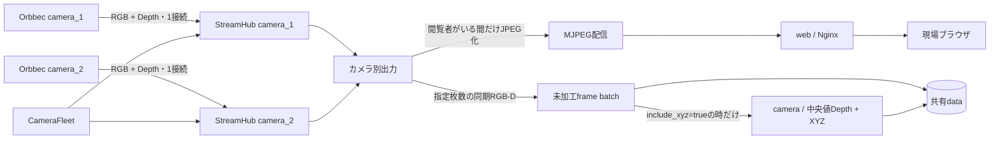
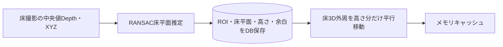
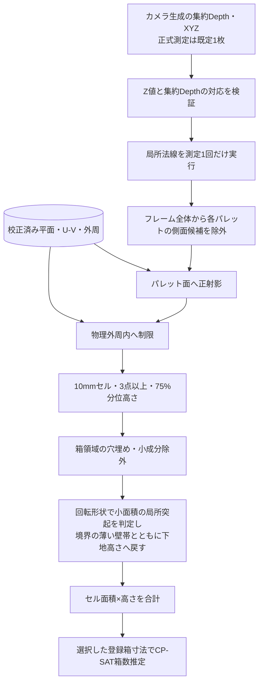
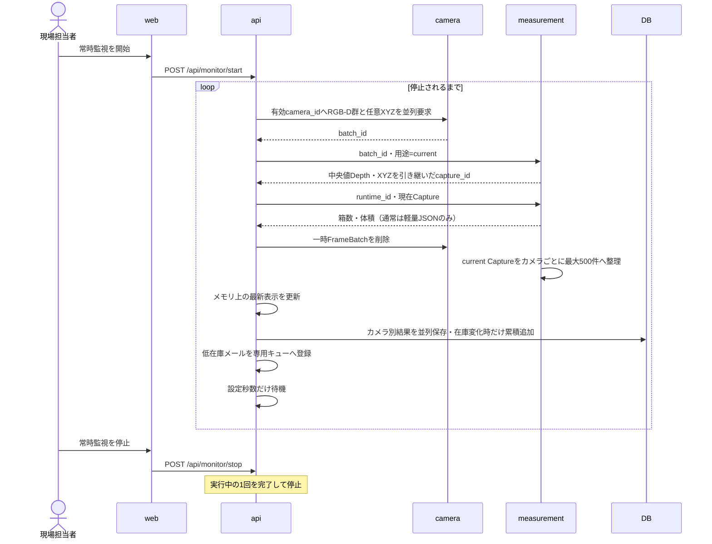

# v2 システム構成

## コンテナ境界

Python処理を行う4サービスとPostgreSQLを、ルートの
`compose.yaml`から一括して参照する。

```text
docker/
├── web/Dockerfile
├── api/{Dockerfile,requirements.txt}
├── camera/{Dockerfile,requirements.txt}
└── measurement/{Dockerfile,requirements.txt}
```

Pythonソースはコンテナ単位でまとめ、測定内部の純粋処理も`measurement`配下へ置く。

```text
src/cardboard_counter_v2/
├── api/
├── camera/
├── measurement/
│   ├── core/
│   └── optimization/
└── common/
```

`common`は3コンテナが共有するHTTP契約、スキーマ、RGB-D形式、保存処理と、
用途非依存のDepth集約・XYZ投影だけを持つ。
これを`measurement`配下へ置くとAPI・cameraからmeasurementへの逆依存が生まれるため、
コンテナ固有コードとは分離する。各Dockerイメージは自サービスと`common`だけをコピーし、
別サービスの実装を含めない。



`camera`だけがOrbbec SDKと物理カメラ接続を持つ。基本出力はRGB、未加工Depth群、
内部パラメータ、時刻に限定し、空パレットや箱といった業務用語は扱わない。
Depthフィルタも適用しない。任意の`include_xyz=true`要求時だけ、汎用処理として時間中央値Depthと
画素対応XYZを生成する。`measurement`は保存された数値配列を入力にCardboard固有計算を行うため、
カメラがなくても保存データから再計算できる。`api`は画像処理を行わず、
2サービスの呼び出しと用途の判断、設定・結果の保存に限定する。

`api`・`measurement`のサービス間通信は内部ネットワークを使う。`camera`は
内部サービス網に加えて、現場LAN上のOrbbecへ到達するための `camera-lan` に接続する。
開発・保守のため、API、カメラ、測定、PostgreSQLはホストの`127.0.0.1`にだけポートを公開する。
LAN上の別ホストからは直接接続できない。
内部ネットワークだけではDockerのhost port publishingが無効になるため、API、測定、PostgreSQLには
それぞれ共有相手のいないホストアクセス専用bridgeを割り当てる。
PostgreSQLのコンテナ間DB通信は専用の`database` internal networkを使い、同networkへ参加する
アプリケーションは`api`だけとする。ホストからの保守接続には`localhost:55432`を使う。
bind mountした`data/database`へホストユーザーがアクセスできるよう、PostgreSQLイメージは
公式16.14をベースに実行UID/GIDをホストと同じ値（既定`1000:1000`）へ合わせる。
Orbbec SDKはEthernet接続時にもlibusbを初期化するため、`camera`だけにホストの
`/dev/bus/usb`を読み取り専用でマウントする。RGB-Dデータの通信経路はUSBではなく`camera-lan`である。

## ソースの責務

| モジュール | 責務 |
|---|---|
| `camera/fleet.py` | camera_id別StreamHubの生成・差分再設定・一括終了 |
| `camera/stream.py` | 1台分のRGB-D常駐接続、自動再接続、ライブ配信とバッチ取得 |
| `camera/frame_batch.py` | 未加工RGB-Dバッチと任意の中央値Depth・XYZ成果物を保存 |
| `camera/point_cloud.py` | 要求時だけ中央値DepthとXYZを各1回生成し、固定投影器を再利用 |
| `common/camera_contracts.py` | 工場・設置情報を含まない、他用途でも使えるRGB-D接続・取得HTTP契約 |
| `common/depth_aggregation.py` | 用途非依存のゼロ除外Depth時間中央値 |
| `common/depth_projection.py` | 用途・ベンダー非依存のDepthから画素対応XYZへの変換 |
| `measurement/preprocessing.py` | 新方式必須の中央値Depth・XYZ成果物をCaptureへ引き継ぐ |
| `measurement/calibration.py` | 床撮影を1回だけ解析し、DB保存用の床平面結果を返却 |
| `measurement/engine.py` | 校正物と現在Depthから体積・箱数を計算 |
| `common/planar_calibration.py` | 他用途でも再利用できる投影・平面領域校正契約 |
| `measurement/runtime.py` | DB由来の平面校正定義から外周・グリッド・マスクを1回作成しキャッシュ |
| `measurement/planning.py` | 対象箱定数と推定器を監視開始前に校正ランタイムへキャッシュ |
| `measurement/prepared_runtime.py` | 校正・箱設定を`runtime_id`へ束ね、測定周期の要求を軽量化 |
| `measurement/analysis.py` | HTTP・保存・HTMLに依存しない新方式の純粋解析 |
| `measurement/optimization/volume_fitting.py` | 測定方式に依存しないOR-Tools CP-SAT体積整数最適化 |
| `measurement/box_estimation.py` | 汎用最適化結果をCardboard測定APIの型へ変換 |
| `common/box_catalog.py` | 共通箱実寸、選択整合性、旧パレット別設定の一回性移行 |
| `measurement/artifacts.py` | 必要な場合だけ3D HTMLと高さ配列の保存を調停 |
| `measurement/volume_mesh.py` | 補正済み高さグリッドを表示用の柱状体積メッシュへ変換 |
| `measurement/height_filled_point_cloud.py` | 採用済み高さグリッドから表示専用の高さ充填・色付き点群を作る |
| `measurement/height_palette.py` | 点群表示で共有する高さ色と、外れ値に強い表示上限を計算する |
| `measurement/point_cloud_view.py` | パレット周辺の表示用投影と、体積採用領域だけへの高さ色の重畳を行う |
| `measurement/debug_point_cloud.py` | 解析済み中間値とRGB画素対応から6段階の実写色点群を作る |
| `measurement/point_cloud_export.py` | 用途非依存のRGB点群を標準LAS 1.2へ書き出す |
| `measurement/potree_adapter.py` | 成果物生成時だけPotreeConverterを1回起動する外部ツール境界 |
| `measurement/potree_html.py` | Potree専用ビューとPlotly体積との切替ページを生成 |
| `measurement/plotly_html.py` | 新方式の柱状体積と段階別診断をPlotly HTMLへ変換 |
| `camera/source.py` | ベンダー非依存のRGB-Dフレームソース契約 |
| `camera/orbbec_adapter.py` | `CameraSettings`をOrbbecソースへ変換しdriver登録 |
| `camera/orbbec_source.py` | Orbbec C++ヘルパーのプロセスライフサイクル |
| `camera/orbbec_protocol.py` | C++ヘルパーのバイナリフレーム解析 |
| `camera/orbbec_build.py` | Orbbec SDK・ヘルパーのパス解決とビルド |
| `measurement/storage.py` | current Captureをカメラごとに最大500件へ整理 |
| `api/app.py` | APIサービスの構成、ルーター登録、起動・終了だけ |
| `api/internal_services.py` | camera・measurement内部HTTP契約の型付き呼び出し |
| `api/ports.py` | ワークフローがHTTP実装へ直接依存しないためのサービス境界 |
| `api/workflows.py` | 既存ルーター向けの薄い互換ファサード |
| `api/workflow/capture_service.py` | FrameBatchからCaptureを作成しDB台帳へ登録 |
| `api/workflow/calibration_service.py` | 校正生成・復元と測定ランタイム準備 |
| `api/workflow/measurement_job_runner.py` | 1台測定と複数カメラの同時実行制御 |
| `api/workflow/retention_service.py` | CaptureファイルとDB台帳の一体削除・件数整理 |
| `api/monitoring.py` | 常時監視タスクと状態のライフサイクル |
| `api/issue_reporting.py` | 例外を原因・対応・画面遷移付きの運用問題へ分類 |
| `api/config_routes.py` | 設定・統合状態・カメラ状態のHTTPエンドポイント |
| `api/field_routes.py` | 床基準校正のHTTPエンドポイント |
| `api/roi_routes.py` | ROI設定用の保存静止画とカメラ別参照撮影を管理 |
| `api/monitor_routes.py` | 常時監視の開始・停止・状態取得エンドポイント |
| `api/debug_routes.py` | カメラ別・用途別・ページ単位の保存撮影取得と、現場状態を変えない再解析 |
| `api/roi_references.py` | DB撮影台帳によるROI参照撮影の選択・検証・カメラ別保持件数 |
| `common/camera_contracts.py` | Cardboard業務語を含まないRGB-D HTTP契約 |
| `common/operational_issues.py` | 画面や通知方法に依存しない運用問題の共通契約 |
| `common/rgbd.py` | ベンダー非依存のRGB-D内部パラメータ |
| `measurement/core/plane_estimation.py` | 空DepthからのRANSAC平面推定 |
| `measurement/core/pallet_geometry.py` | パレットU-V座標と物理外周マスク |
| `measurement/core/height_grid.py` | 局所法線、平面投影、75%分位高さグリッド |
| `measurement/core/protrusion_filter.py` | 回転に依存しない形状で折り畳み看板と境界の薄い壁状成分を除外 |
| `measurement/core/component_geometry.py` | 2次元成分を回転外接矩形で計測する汎用純粋関数 |
| `api/state.py` | 校正前の選択状態だけを保持するプロセスメモリ |
| `api/box_catalog_repository.py` | DBを正本とする箱種類・外寸の読込みとORM更新 |
| `api/dashboard_routes.py` | 工場マップPNG、パレット配置、マップ削除、DB由来最新状態のHTTPエンドポイント |
| `api/inventory/models.py` | SQLAlchemy ORMによる設定・Capture・校正・在庫履歴・工場マップ12テーブルの定義 |
| `api/inventory/repository.py` | 既存サービス向けのDBリポジトリ互換ファサード |
| `api/inventory/repositories/settings_repository.py` | カメラ・設置・監視枠・測定設定の同期 |
| `api/inventory/repositories/capture_repository.py` | Capture台帳とカメラ固有値の照合 |
| `api/inventory/repositories/calibration_repository.py` | 校正履歴の保存・実行定義への復元 |
| `api/inventory/repositories/measurement_repository.py` | リアルタイム測定・失敗・メール送信結果の保存 |
| `api/inventory/repositories/history_repository.py` | 在庫変化履歴と6か月保持整理 |
| `api/inventory/repositories/dashboard_repository.py` | ダッシュボード用の最新測定状態を読み出す専用クエリ |
| `api/inventory/repositories/factory_map_repository.py` | 工場マップ画像とpallet_slot_id別配置のORM永続化・削除 |
| `api/dashboard_status.py` | DB・HTTPに依存しないダッシュボード状態判定 |
| `api/inventory/domain.py` | DB非依存の低在庫・回復状態遷移判定 |
| `api/inventory/service.py` | DB障害を測定処理から分離し接続状態を保持 |
| `api/service_client.py` | サーバー稼働中の内部HTTP接続を共有 |
| `deploy/cameras.json` | 1カメラ1コンテナのIDと既定ホストポートの宣言 |
| `tools/camera-service` | カメラサービスの計画・生成・検証・既存イメージでの起動 |
| `tools/release-images` | 全サービスの固定タグ作成、明示push、digestロック、tar保存 |
| `frontend/src/StaticImageRectangleEditor.tsx` | 保存静止画上の正規化矩形ドラッグ選択 |
| `frontend/src/RoiEditor.tsx` | 保存床画像上で床基準ROIを設定 |
| `frontend/src/SettingsCameraSelector.tsx` | ROIより上に置く設定対象カメラの共通選択欄 |
| `frontend/src/CameraSettingsEditor.tsx` | 選択中の1台だけを編集するカメラ設定UI |
| `frontend/src/CameraPalletEditor.tsx` | 選択カメラ配下のパレットと対象箱だけを編集 |
| `frontend/src/cameraSettings.ts` | UIに依存しないcamera_id・初期接続先の生成 |
| `frontend/src/routes.ts` | Reactに依存しないURL解析・生成と画面ルート型 |
| `frontend/src/useAppRouter.ts` | History APIとブラウザの戻る／進むの管理 |
| `frontend/src/CameraSelector.tsx` | 現場・設定・診断で共有するカメラ選択部品 |
| `frontend/src/Ipv4AddressField.tsx` | 4区画入力・貼り付け・キーボード移動に対応するIPv4入力部品 |
| `frontend/src/ipv4.ts` | UIに依存しないIPv4の分割・結合・正規化・検証 |
| `frontend/src/SystemStatusBar.tsx` | 全画面共通の監視操作・状態・通知表示 |
| `frontend/src/ActionButton.tsx` | 無効理由をツールチップと読み上げへ共通提供する操作ボタン |
| `frontend/src/BackToTopButton.tsx` | IntersectionObserverで必要時だけ表示する再利用可能な上部移動ボタン |
| `frontend/src/OperationalIssueCard.tsx` | 原因・対応・技術詳細を分ける再利用可能な問題表示 |
| `frontend/src/changeTracking.ts` | 保存済み設定との差分を判定するUI非依存関数 |
| `frontend/src/remoteResource.ts` | 初回読込・失敗・正常・古い正常値の表示状態判定 |
| `frontend/src/useUnsavedChangesWarning.ts` | 未保存設定がある場合だけ離脱警告を登録 |
| `frontend/src/useSettingsIssueNavigation.ts` | 設定エラーから対象カメラ・詳細欄・入力欄へ移動 |
| `frontend/src/controllers/useMonitorController.ts` | 状態polling、監視開始・停止、校正済み状態 |
| `frontend/src/useDebugCaptureCatalog.ts` | 診断対象カメラ別の保存撮影取得、通信中断、追加読込み |
| `frontend/src/debugCaptures.ts` | 撮影元ラベルと重複しないページ連結の純粋関数 |
| `frontend/src/controllers/useDashboardController.ts` | 工場マップpolling、最後の正常値、通信失敗、再取得の管理 |
| `frontend/src/controllers/useSettingsController.ts` | 設定・ROI・校正の読込み、編集、保存 |
| `frontend/src/controllers/useCameraController.ts` | 共有カメラ選択とライブ映像表示状態 |
| `frontend/src/FactoryMapDashboard.tsx` | 工場マップ画面の選択・集計・保存を調整する親コンポーネント |
| `frontend/src/factory-map/cameraList.ts` | 通信やReactに依存しないカメラ一覧表示モデルの構築 |
| `frontend/src/factory-map/FactoryCameraList.tsx` | キーボード操作可能なカメラ・パレット状態一覧 |
| `frontend/src/factory-map/FactoryMapCanvas.tsx` | react-konvaによるPNG・パレット別状態マーカー描画とドラッグ操作 |
| `frontend/src/factory-map/FactoryMapUpload.tsx` | 工場マップPNGの登録フォーム |
| `frontend/src/factory-map/FactoryMapToolbar.tsx` | フロア選択と配置編集操作 |
| `frontend/src/factory-map/useFactoryMapEditor.ts` | 保存済み配置と編集中配置の状態管理 |

`FieldPage`、`SettingsPage`、`DebugPage`はルート単位で遅延読込みし、開いていない機能のコードを
初回バンドルへ含めない。新しい画面機能も同じ境界で追加する。
`App.tsx`はController同士とルートを接続するだけとし、API通信と周期処理は所有するControllerへ置く。
設定の未保存状態は`changeTracking.ts`のUI非依存な値比較を使い、`useSettingsController`が現在値と
保存済み基準から派生算出する。操作履歴を別stateへ重複保持せず、設定値が変わった時だけ再計算する。
設定エラーも同じControllerで構造化してメモ化し、表示時やpolling周期では再検証しない。
ダッシュボードの定期取得は同時リクエストを共有し、失敗時も最後の正常値を破棄しない。

実装時はカメラ固有処理と汎用処理を分け、UI非依存関数、再利用部品、画面Controller／Hook、
業務固有画面の順に責務を分離する。一度準備すればよい設定、固定値、表示モデル、接続初期化を
周期ループへ入れず、値が変わる時だけ再計算する。単純な処理まで過剰分割せず、再利用または
独立テストできる境界がある場合に分ける。
カメラ接続先はIPv4リテラルに限定し、Frontendの入力検証に加えて`CameraDeviceSettings`でも
Python標準の`IPv4Address`を使って検証する。これにより不正値をカメラ設定配布・DB保存前に拒否する。

## ROI設定



UIが扱うROIは `plane_roi`（床上のパレット定位置）だけとする。RGB画像比率の
`[left, top, right, bottom]`で保存し、RGBと位置合わせ済みのDepth座標へ
`measurement`側が変換する。確定したROIは`pallet_calibrations.calibration_data.roi`だけへ
保存し、`pallet_slots`には重複保存しない。校正前の編集値はAPIプロセスメモリで一時保持し、
変更時は保存済み平面校正を無効化する。
`pallet_slots`は`camera_installation_id`へ直接紐づけ、移設・解像度変更などで撮影幾何が
変わった場合は新しい設置履歴とパレット枠を作る。旧枠は過去の校正・測定履歴とともに残す。
撮影は設定ボタンを押した時だけ実行し、常時監視ループには含めない。床画像は
時間中央値Depthも保存して校正入力へそのまま再利用する。
保存済み床撮影の選択時は、DB撮影台帳のカメラID、永続区分、床撮影種別、RGB整列、Depth・RGB・XYZの
存在を確認する。床撮影はカメラごとに最大5件とし、選択または新規撮影が成功した後だけ、
現在使用中の撮影を除く最古データから超過分を削除する。この整理は常時監視ループでは実行しない。

DBの`captures`は`camera_installation_id`を持ち、RGB・Depth形状、整列条件、内部・歪み
パラメータは撮影時の`camera_installations`行から復元する。
カメラサービス自体は未整列Depthも表現できるが、Cardboardの新方式は
RGB座標へ整列済みのDepth以外を前処理時に拒否する。

## カメラストリーム



ライブ表示と測定は別々にOrbbecへ接続しない。`camera`内では登録カメラごとのバックグラウンドスレッドが
1本ずつSDKストリームを所有し、最新RGBをMJPEGへ、同期RGB-D群を汎用frame batchへ配布する。
カメラはCardboard用保存を行わない。時間中央値とXYZは汎用の任意出力であり、要求がない場合は計算しない。
C++ヘルパーはネットワークカメラ向けのSDKコールバックでFrameSetを受信し、RGBとDepthが両方そろった
FrameSetだけをスレッド安全な最新1件の受け渡し枠へ置く。プロファイル選択、D2C設定、内部パラメータ取得は
接続開始時に1度だけ行い、フレームループでは完成済みRGB-Dペアの変換と出力だけを行う。
異なるFrameSetのRGBとDepthは組み合わせない。このベンダー固有処理はC++ヘルパーに閉じ、Python側は
`FrameSource`契約を通じて他のRGB-Dドライバーと同じ形で扱う。
このストリームは`camera`のFastAPI起動時に開始し、コンテナ終了時に停止する。ブラウザは
MJPEGの購読だけを開始・終了し、C++サブプロセスのライフサイクルには影響しない。
そのためHTTPの「ストリーム開始」APIは持たず、カメラ一覧の設定APIだけを持つ。
Orbbec通信またはC++サブプロセスが異常終了した場合、FastAPIのバックグラウンドスレッドが
3秒後に新しいサブプロセスを生成する。したがってサーバー稼働期間中は自動再接続を続ける。

各Hubのウォームアップ枚数はカメラ接続直後（再接続後を含む）にだけ消化する。
安定後は測定ごとに同じ枚数を捨てない。MJPEG閲覧者が0人の間はJPEG変換も行わない。

## 新方式の処理

### 床基準：1度だけ行う校正



PostgreSQLの`pallet_calibrations`は1パレットにつき1行とし、対象設置履歴、床撮影の
`calibration_capture_id`、グリッド幅、パレット番号を通常カラムへ保存する。ROI・床平面法線・床平面オフセット・パレット高さ・余白は
1パレット分の`calibration_data`へ保存する。原点、U-V基底、外周、グリッドマスクなどの
計算用詳細データはDBの値から導出し、校正manifestやNPZマスクは保存しない。通常測定ループで空Depthを読み直したり、
RANSACを再実行したりしない。
新規床撮影のXYZはカメラが中央値Depthから1回だけ生成し、同じカメラの有効パレットで共有する。
XYZを持たない旧保存撮影の互換経路は持たず、新方式のCaptureでは中央値DepthとXYZを必須とする。
床ROI、有効パレット、グリッド幅、パレット高さ、余白の変更時だけ保存済み床Depthから再校正する。
カメラ設定変更時は、床の再撮影が必要になる。
測定サービスはDB由来の校正定義から再構築したマスク・物理座標・内部パラメータをメモリに保持し、
同じ校正IDと解像度の次回測定で固定投影値の計算を繰り返さない。

### 現在測定時：ループする処理



高さ基準の選択肢は存在せず、APIスキーマでも `method=pallet_plane_2roi` に固定する。

## 常時監視



監視中も測定処理は `pallet_plane_2roi` のみを呼び出す。失敗時はカメラ別に、利用者向けの
原因・対応方法・遷移先と保守向け技術詳細を構造化して状態に保持する。監視自体は停止せず
次の周期で再試行する。生のエラー文字列もDB履歴と後方互換のため保持する。設定変更・床基準再撮影・
デバッグ診断は監視停止中だけ許可する。ただし低在庫警告体積とメール再有効化増加量だけは
監視中も変更でき、次周期から反映する。1回の測定サイクル自体はAPIロックで排他しつつ、
異なるcamera_idの撮影・前処理・測定は並列化し、同一カメラの処理だけを直列化する。
イベントループとDB保存用Semaphoreは監視開始時に一度だけ取得・生成する。通知送信関数や
エラー分類規則も周期内では生成せず、通常周期には測定ごとに必要な処理だけを置く。

Cardboard Counterの現場設定は、1カメラにつきパレット1・2の2枠固定とする。カメラ追加時に
2枠を一度だけ生成し、不要な枠は`enabled=false`にする。カメラ取得サービス自体はパレットを
知らないため、別用途でも再利用できる。技術用の`pallet_id`は全体で一意に保ち、画面表示には
カメラ内の`pallet_number`（1または2）を使う。

常時監視では、生Depth群の重複ファイルを作らず、一時FrameBatchをCapture作成後に削除します。
中央値Captureはデバッグ用に
カメラごとに最大500件保持する。測定ディレクトリ、`height_grid.npz`、3D HTML、
最新結果JSONは作らず、正式履歴をPostgreSQLへ保存する。
現場用の単発測定は持たない。デバッグ画面では、選択した1台をその場で撮影するか、
保存済みの撮影を選択して、新方式の段階別3Dを明示的に生成する。
current Captureは監視・デバッグを合わせて501件目の作成直後に最古を削除し、起動中の定期整理も同じ上限を補完する。
診断画面の共有カメラ選択は現在撮影と保存データ再解析の両方に適用する。APIは同じカメラの
床Captureとcurrent CaptureだけをDBで抽出し、Frontendで全カメラ分を走査しない。current Captureは
`retention`を問わず、通常監視を「通常監視」、手動診断撮影を「診断撮影」と表示する。
新しい順に50件を取得し、要求された場合だけ次の50件を取得する。再解析時のパレットとROIは
Captureへ複製せず、現在保存されている同じカメラの設定を使う。

3D HTMLは実行時に外部CDNへ接続しない。Plotly本体はフロントエンドのビルド／起動準備時に1回だけ
`/vendor/plotly/plotly.min.js`へ配置し、すべての診断HTMLから共有する。Potreeビューア資産も
Webイメージのビルド時に固定バージョンを取得して`/vendor/potree`へ配置する。
各手動成果物では周辺付き診断点群と高さ充填点群をそれぞれLASへ書き、PotreeConverterが`metadata.json`、
`hierarchy.bin`、`octree.bin`へ変換する。高さ充填点群は解析後の採用セルだけを使う表示専用データで、
体積計算へは戻さない。周辺付き点群は実測点の形状と周辺のRGBを保ち、体積採用セル内かつ採用高以下の点だけを
高さ色へ置き換える。色上限は採用セル高さの98パーセンタイルで、表示上の孤立高点は上限色へ丸めるが、
測定値・点位置・除外判定には戻さない。高さ充填点群はPotreeの標高属性でパレット面からの
高さを灰色→橙→赤に表示する。変換器は`measurement`イメージにだけ存在し、常時監視経路では起動しない。
したがって診断HTMLごとのライブラリ重複や、監視ループ内の取得・変換処理はない。

段階別診断を明示生成した場合だけ、同じ6段階をPotreeでも生成する。各段階は、残った点だけを元RGBで表示する
「実写色」と、共通の周辺背景へその段階の処理対象を赤で重ねる「背景＋赤強調」を切り替える。
段階4〜6は表面点群と立体充填も切り替えられる。立体充填は校正済みパレット面を0mmとしてセル上面までを
基本20mm間隔で埋める表示専用データで、段階4は補正前高さ、段階5・6は補正後高さを使う。
段階5と6は同じ充填Potree成果物を共有し、LAS出力と変換を重複させない。
元RGB画素番号は高さグリッド生成時の診断データとして保持し、数値解析をやり直さない。通常監視ではこの保持、
LAS出力、Potree変換のいずれも行わない。

## 箱クラスの整数最適化

新方式の高さグリッドから求めた実測体積を変更せず、後段の独立処理でOR-Tools CP-SATへ渡す。
共通`box_catalog`のうち、パレットの`single_box_labels`を1種類ずつ、`mixed_box_groups`を
同時配置可能な組み合わせとして個別に最適化する。許可された各ルールの候補を比較し、
次の誤差が最小になる非負整数個数を求める。

```text
|実測体積 - Σ(箱クラス個数 × 箱クラス外寸体積)|
```

これにより、単品A・Bと混在B+Cを設定した場合にA+Bを候補へ入れない。混在グループ内の個数は0も許すため、
消費後にCだけが残った状態も扱える。学習モデル推論、旧Depth差分、旧測定方式は呼び出さない。
箱ラベル・寸法・1mL整数単位は、設定が変わるまで
キャッシュする`MeasurementPlan`の作成時に準備する。実測体積は毎回変わるためCP-SATモデルの
右辺と求解だけは測定ごとに実行する。最良誤差から「実測体積の1%または最小箱体積の5%」以内に
異なる内訳があれば、最大5候補を保存して`ambiguous=true`とする。`reference_box_label`は
局所突起判定に使う。旧パレット別の箱設定は設定ファイル読込時の1回だけ共通カタログと選択ラベルへ変換する。

監視開始前にDB由来の校正ランタイムと`MeasurementPlan`を準備する。校正平面、外周マスク、箱定数、CP-SATの
固定部分をループ中に作らない。カメラ・設置マスターもAPI起動時または設定保存時だけ同期し、
各測定結果のDB保存時には同期しない。現在XYZ、局所法線、高さグリッド、求解は撮影ごとに変わるため、
1撮影につき各1回だけ実行する。校正ランタイムとDB校正定義は30台構成を追い出さない64件上限で保持する。

## デバッグ再解析

DB撮影台帳の一覧は画面表示または手動更新のときだけ取得し、定期ポーリングしない。
選択した空Depthで校正し、選択した現在Depthを `measurement/analysis.py` の同じ処理へ通す。
空撮影、有効パレット、平面ROI、グリッド幅が同じ場合は校正IDを再利用し、RANSACを再実行しない。
診断専用の測定アルゴリズムは持たない。大きな中間点群は再解析時だけ最大12,000点へ間引く。
永続`runtime.json`は持たず、デバッグ結果はHTTPレスポンスと測定artifactだけで返す。

## 永続データ

```text
data/
├── database/                         # PostgreSQLデータディレクトリ
├── camera/
│   └── frame_batches/<batch_id>/     # Capture作成後に削除する一時データ
│       ├── depth_frames.npz
│       ├── rgb.jpg
│       ├── intrinsics.json
│       ├── metadata.json
│       └── manifest.json
├── captures/<camera_id>/
│   ├── floor/<capture_id>/
│   │   ├── depth.npz
│   │   ├── xyz.npz
│   │   └── rgb.jpg
│   └── current/<capture_id>/
│       ├── depth.npz
│       ├── xyz.npz
│       └── rgb.jpg
├── measurements/<measurement_id>/
│   └── pallet_<n>/                 # 診断成果物を生成する場合のみ
│       ├── height_grid.npz
│       ├── plot.html                # 体積／生点群／高さ充填点群切替
│       ├── volume.html              # Plotly柱状体積
│       ├── point_cloud.html         # Potree専用ビュー
│       ├── point_cloud.las          # RGB標準点群（m、Z-up）
│       ├── potree/
│       │   ├── metadata.json
│       │   ├── hierarchy.bin
│       │   └── octree.bin
│       ├── height_filled.html       # 高さ色付きの充填Potreeビュー
│       ├── height_filled.las        # パレット面から上面までの表示用点群
│       ├── height_filled/
│       │   ├── metadata.json
│       │   ├── hierarchy.bin
│       │   └── octree.bin
│       ├── debug_stages.html          # カラーマップ／点群切替（デバッグ再解析時のみ）
│       ├── debug_point_cloud.html     # 段階別Potreeビュー
│       └── debug_point_cloud/         # 共通背景、6段階の表面点群、段階4〜6の共有充填点群
└── ...
```
