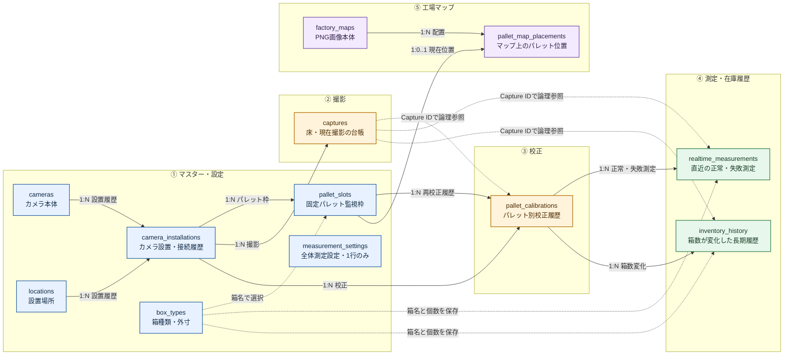
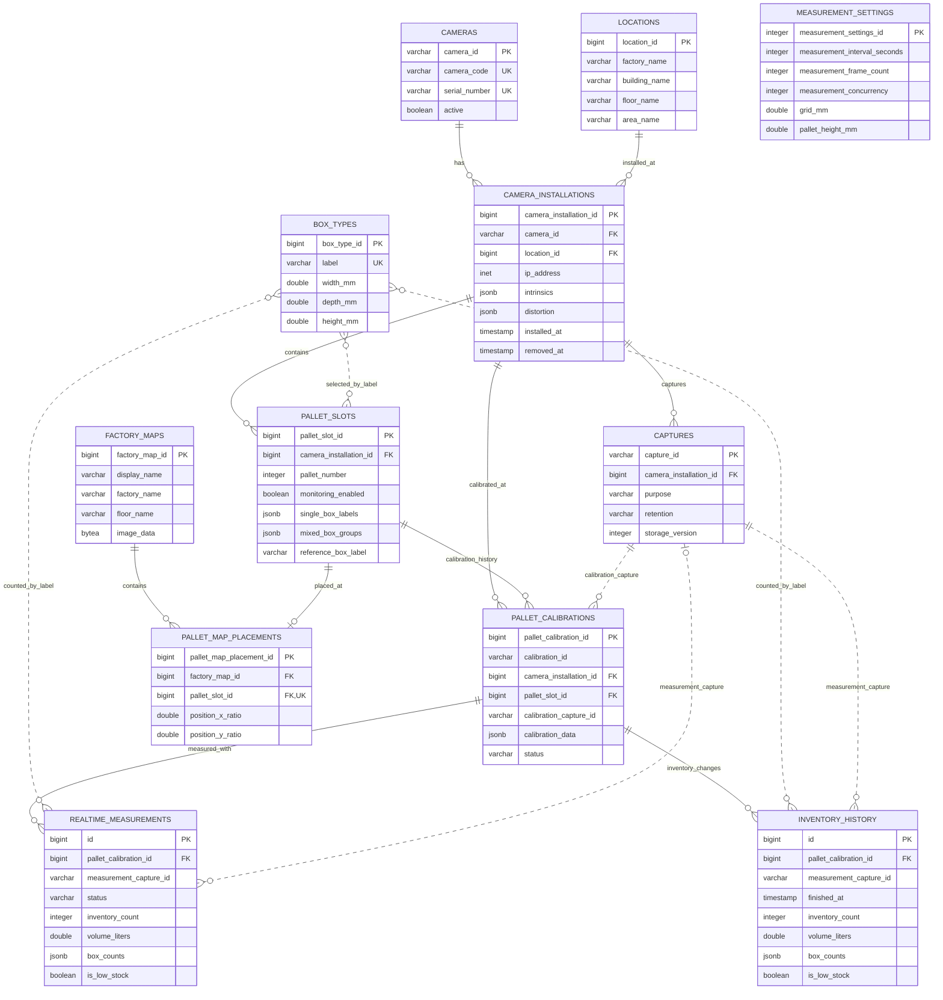

# Cardboard Counter v2 データベーステーブル・格納値例

更新日: 2026-09-01（Asia/Tokyo）

## 1. この文書について

この文書は、Cardboard Counter v2がPostgreSQLへ保存するデータを、テーブルとカラム単位で説明するための資料です。

- 対象は現行の12テーブル、全132カラムです。
- 実データがまだ存在しない校正・測定テーブルについては、実装どおりの形式を示す架空値を使用しています。
- IPアドレス、製造番号、工場名などの例は実在する設備を示さない説明用の架空値です。
- 日時は説明しやすいよう日本標準時表記にしています。PostgreSQLでは`timestamp with time zone`として扱います。
- `NULL可`と記載した項目以外は原則として必須です。

## 2. テーブル関係

### 2.1 最初に見る全体図

まずは、各テーブルを「マスター・設定」「撮影」「校正」「測定・在庫履歴」「工場マップ」に分けて見ると理解しやすくなります。



この図は左から次の順に読みます。

1. カメラ、設置場所、パレット枠、箱、測定条件を設定する。
2. カメラで床または現在状態を撮影し、`captures`へ台帳を登録する。
3. 床Captureからパレットごとの校正を作り、`pallet_calibrations`へ保存する。
4. 現在Captureと校正を使って測定し、`realtime_measurements`へ保存する。
5. 正式な整数箱数が変化したときだけ、`inventory_history`へ長期履歴を追加する。
6. 工場マップとパレット位置は測定値から独立して保存する。

> **重要:** 正常・失敗のどちらも`pallet_calibration_id`を必須とし、そこからパレット枠、設置履歴、カメラを特定します。失敗時に`NULL`となるのは`measurement_capture_id`と測定値です。

### 2.2 詳細ER図

次の図は、主キー・外部キーと代表カラムを含むデータベース寄りの詳細図です。



### 2.3 詳細ER図の読み方

- `||--o{`は「親1件に対して子0件以上」のDB外部キー関係です。
- `||--o|`は「親1件に対して子0件または1件」の関係です。
- `..`の点線は、IDや箱名を保存してアプリケーションで整合性を管理する論理参照です。DBの外部キー制約はありません。
- `PK`は主キー、`FK`は外部キー、`UK`は一意制約を示します。
- `measurement_settings`は他テーブルを参照せず、システム全体でID=1の1行だけを持ちます。
- 図では関係を読みやすくするため代表カラムだけを掲載しています。全カラムは後続の各テーブル説明に掲載しています。

### 2.4 テーブル間関係の一覧

#### DB外部キーで保証される関係

| 親テーブル | 子テーブル | 関係 | 接続カラム | 意味 |
|---|---|---:|---|---|
| `cameras` | `camera_installations` | 1:N | `camera_id` | 1台のカメラに複数の設置履歴を残せる |
| `locations` | `camera_installations` | 1:N | `location_id` | 1場所に複数時点のカメラ設置履歴を残せる |
| `camera_installations` | `captures` | 1:N | `camera_installation_id` | Captureが撮影時の設置・取得条件を参照する |
| `camera_installations` | `pallet_slots` | 1:N | `camera_installation_id` | 1つのカメラ設置状態がパレット1・2の監視枠を持つ |
| `camera_installations` | `pallet_calibrations` | 1:N | `camera_installation_id` | どの設置状態で校正したかを残す |
| `pallet_slots` | `pallet_calibrations` | 1:N | `pallet_slot_id` | 再校正しても過去の校正履歴を残す |
| `pallet_calibrations` | `realtime_measurements` | 1:N | `pallet_calibration_id` | 正常・失敗測定の対象パレットと使用予定だった校正を特定する |
| `pallet_calibrations` | `inventory_history` | 1:N | `pallet_calibration_id` | 長期在庫履歴が使用した校正を特定する |
| `factory_maps` | `pallet_map_placements` | 1:N | `factory_map_id` | 1マップへ複数パレットを配置する |
| `pallet_slots` | `pallet_map_placements` | 1:0..1 | `pallet_slot_id` | 1パレットは同時に1マップだけへ配置できる |

#### アプリケーションが管理する論理参照

| 参照元 | 参照先 | 保存値 | DB外部キーにしていない理由・扱い |
|---|---|---|---|
| `pallet_slots` | `box_types` | `single_box_labels`、`mixed_box_groups`、`reference_box_label` | 箱名の配列をJSONBで保持し、設定保存時に存在確認する |
| `realtime_measurements` | `box_types` | `box_counts`の箱名 | 測定時点の箱名と個数をスナップショットとして残す |
| `inventory_history` | `box_types` | `box_counts`の箱名 | 箱マスター変更後も過去の内訳をそのまま残す |
| `pallet_calibrations` | `captures` | `calibration_capture_id` | 校正に使用した床Capture IDを保存する |
| `realtime_measurements` | `captures` | `measurement_capture_id` | 正常測定に使用した現在Capture IDを保存する |
| `inventory_history` | `captures` | `measurement_capture_id` | 在庫変化を発生させた現在Capture IDを保存する |

### 2.5 文字だけで見る関係の要約

```text
【設備・設定】
cameras 1 ──< N camera_installations N >── 1 locations
camera_installations 1 ──< N pallet_slots

【撮影】
camera_installations 1 ──< N captures

【校正】
camera_installations 1 ──< N pallet_calibrations N >── 1 pallet_slots

【測定・在庫履歴】
pallet_calibrations 1 ──< N realtime_measurements
pallet_calibrations 1 ──< N inventory_history

【工場マップ】
factory_maps 1 ──< N pallet_map_placements N >── 1 pallet_slots

【独立・論理参照】
measurement_settings : システム全体で1行
box_types             : 箱名でpallet_slotsと測定履歴から論理参照
captures              : Capture IDで校正・測定・在庫履歴から論理参照
```

主な処理と保存先は次のとおりです。

| 操作 | 主に更新されるテーブル |
|---|---|
| 設定保存 | `box_types`、`cameras`、`locations`、`camera_installations`、`pallet_slots`、`measurement_settings` |
| 床・現在画像の撮影 | `captures`。最初の撮影時は`camera_installations`の内部・歪みパラメータも更新 |
| 床基準校正 | `pallet_calibrations` |
| 正常測定 | `realtime_measurements`、条件を満たす場合は`inventory_history` |
| 測定失敗 | `realtime_measurements` |
| 工場マップ登録 | `factory_maps` |
| マップ上のパレット配置 | `pallet_map_placements` |

### 2.6 DBのまとまりと関連ファイル階層

PostgreSQLを設定・台帳・履歴の正本とし、容量の大きいRGB・Depth・XYZと手動診断成果物だけを
`data/`以下の共有ファイル領域へ保存します。DBのまとまりとファイルの対応は次のとおりです。

#### ① マスター・設定

対象テーブル:

```text
box_types
cameras
locations
camera_installations
pallet_slots
measurement_settings
```

このまとまりに対応する画像ファイルはありません。カメラ識別情報、撮影条件、箱設定、
測定周期などはPostgreSQLだけで管理します。確定したROIは校正グループへ保存します。

#### ② 撮影

対象テーブル:

```text
captures
```

床校正用と正式測定用の両方のCaptureを、用途別に次の階層へ保存します。

```text
data/
└── captures/
    └── <camera_id>/
        ├── floor/
        │   └── <capture_id>/
        │       ├── rgb.jpg       # ROIを設定するときに表示する床RGB画像
        │       ├── depth.npz     # 集約済みの床Depth
        │       └── xyz.npz       # 床Depthから生成したXYZ
        └── current/
            └── <capture_id>/
                ├── rgb.jpg       # 測定時のRGB画像
                ├── depth.npz     # 集約済みの現在Depth
                └── xyz.npz       # 現在Depthから生成したXYZ
```

`captures`が両用途の撮影台帳を持ち、`purpose`の`floor`または`current`によって保存先を
決定します。校正と測定のテーブルはCapture IDを使って、この撮影台帳を論理参照します。

#### ③ 校正

対象テーブル:

```text
pallet_calibrations
```

校正では、撮影グループの床Captureを次の関係で使用します。

```text
pallet_calibrations.calibration_capture_id
    └── captures.capture_id
        └── data/captures/<camera_id>/floor/<capture_id>/
```

校正のROI、床平面、パレット高さなどは`pallet_calibrations.calibration_data`へ保存します。
校正専用の画像、永続JSON、マスクファイルは新たに作成しません。

#### ④ 測定・在庫履歴

対象テーブル:

```text
realtime_measurements
inventory_history
```

測定・在庫履歴では、撮影グループの現在Captureを次の関係で使用します。

```text
realtime_measurements.measurement_capture_id
inventory_history.measurement_capture_id
    └── captures.capture_id
        └── data/captures/<camera_id>/current/<capture_id>/
```

通常監視の体積、箱数、箱内訳、警告状態はPostgreSQLへ保存し、測定結果JSONは作成しません。

保守・診断画面から3D診断成果物を要求した場合だけ、次のファイルを追加で作成します。

```text
data/
└── measurements/
    └── <measurement_id>/
        └── pallet_<pallet_number>/
            ├── height_grid.npz
            ├── plot.html
            ├── volume.html
            ├── point_cloud.html
            ├── point_cloud.las
            ├── potree/
            │   ├── metadata.json
            │   ├── hierarchy.bin
            │   └── octree.bin
            ├── height_filled.html
            ├── height_filled.las
            ├── height_filled/
            │   ├── metadata.json
            │   ├── hierarchy.bin
            │   └── octree.bin
            ├── debug_stages.html
            ├── debug_point_cloud.html
            └── debug_point_cloud/...
```

この`measurements/`階層は画面表示用の診断成果物であり、正式な在庫履歴の正本ではありません。
通常の10分監視では作成しません。

#### ⑤ 工場マップ

対象テーブル:

```text
factory_maps
pallet_map_placements
```

工場マップPNGは`factory_maps.image_data`へ`bytea`として保存します。そのため、対応する
`data/maps/`などの画像ディレクトリは作成しません。マーカー座標も
`pallet_map_placements`だけで管理します。

#### Capture作成前の一時ファイル

cameraサービスが撮影してから正式なCaptureを作るまでの間だけ、次の一時FrameBatchを使用します。

```text
data/
└── camera/
    └── frame_batches/
        └── <batch_id>/
            ├── depth_frames.npz
            ├── rgb.jpg
            ├── intrinsics.json
            ├── metadata.json
            └── manifest.json
```

Capture作成後はFrameBatch単位で削除します。異常終了で残った場合も保持期限を過ぎると整理され、
DBの正本や長期保存用画像としては扱いません。

## 3. `box_types` — 箱マスター

箱名と外寸を管理します。外寸体積はDBへ重複保存せず、`width_mm × depth_mm × height_mm`で計算します。

| カラム | PostgreSQL型 | 例 | 説明 |
|---|---|---|---|
| `box_type_id` | `bigint` PK | `2` | 自動採番される箱ID |
| `label` | `varchar` UNIQUE | `再生250P` | 箱名。大文字・小文字を含めアプリ側でも重複を検証 |
| `width_mm` | `double precision` | `450.0` | 箱外寸の幅（mm） |
| `depth_mm` | `double precision` | `400.0` | 箱外寸の奥行（mm） |
| `height_mm` | `double precision` | `240.0` | 箱外寸の高さ（mm） |
| `created_at` | `timestamp with time zone` | `2026-08-28T10:00:00+09:00` | 登録日時 |
| `updated_at` | `timestamp with time zone` | `2026-08-28T10:00:00+09:00` | 最終更新日時 |

上記例の外寸体積は次のとおりです。

```text
450 × 400 × 240 = 43,200,000 mm³ = 43.2 L
```

## 4. `cameras` — カメラ本体マスター

物理カメラそのものの識別情報を管理します。IPアドレス、設置場所、解像度と、その条件で取得した内部・歪みパラメータは`camera_installations`へ保存します。

| カラム | PostgreSQL型 | 例 | 説明 |
|---|---|---|---|
| `camera_id` | `varchar` PK | `camera_1` | システム内部のカメラ識別子 |
| `camera_code` | `varchar` UNIQUE | `CAM-001` | 管理用カメラコード |
| `manufacturer` | `varchar` NULL可 | `Orbbec` | メーカー名 |
| `model_name` | `varchar` NULL可 | `Femto Bolt` | 機種名 |
| `serial_number` | `varchar` UNIQUE、NULL可 | `SN-EXAMPLE-001` | 製造番号 |
| `display_name` | `varchar` | `カメラ1` | UI表示名 |
| `active` | `boolean` | `true` | 現在の設定で使用するカメラか。削除時は通常`false` |
| `created_at` | `timestamp with time zone` | `2026-08-28T10:00:00+09:00` | 登録日時 |
| `updated_at` | `timestamp with time zone` | `2026-08-28T10:05:00+09:00` | 最終更新日時 |

## 5. `locations` — 設置場所マスター

工場・建物／工場棟・フロア・任意エリアをカメラ本体から分離して管理します。

| カラム | PostgreSQL型 | 例 | 説明 |
|---|---|---|---|
| `location_id` | `bigint` PK | `1` | DBが自動採番する設置場所ID |
| `factory_name` | `varchar` NULL可 | `長岡工場` | 拠点となる工場名。UI保存時は必須 |
| `building_name` | `varchar` NULL可 | `第5工場` | 建物・工場棟名。UI保存時は必須 |
| `floor_name` | `varchar` NULL可 | `3階` | フロア名。UI保存時は必須 |
| `area_name` | `varchar` NULL可 | `資材置場A` | 課・置場などの任意エリア名 |
| `created_at` | `timestamp with time zone` | `2026-08-28T10:00:00+09:00` | 登録日時 |
| `updated_at` | `timestamp with time zone` | `2026-08-28T10:00:00+09:00` | 最終更新日時 |

## 6. `camera_installations` — カメラ設置・接続履歴

どのカメラが、どの場所へ、どの接続条件で設置されていたかを履歴管理します。

| カラム | PostgreSQL型 | 例 | 説明 |
|---|---|---|---|
| `camera_installation_id` | `bigint` PK | `10` | 自動採番される設置履歴ID |
| `camera_id` | `varchar` FK | `camera_1` | `cameras.camera_id` |
| `location_id` | `bigint` FK | `1` | `locations.location_id` |
| `ip_address` | `inet` | `192.0.2.10` | カメラのIPアドレス。例は文書用アドレス |
| `port` | `integer` | `8090` | カメラ接続ポート |
| `camera_service_url` | `text` | `http://camera-1:8001` | 担当cameraコンテナの内部URL |
| `installed_at` | `timestamp with time zone` | `2026-08-28T10:00:00+09:00` | 設置開始日時 |
| `removed_at` | `timestamp with time zone` NULL可 | `NULL` | 設置終了日時。現役なら`NULL` |
| `mounting_note` | `text` NULL可 | `資材置場上部、床から3m` | 設置位置などのメモ |
| `created_at` | `timestamp with time zone` | `2026-08-28T10:00:00+09:00` | 行の作成日時 |
| `updated_at` | `timestamp with time zone` | `2026-08-28T10:05:00+09:00` | 最終更新日時 |
| `driver` | `varchar` | `orbbec_network` | 使用するカメラドライバー |
| `color_width` | `integer` | `1280` | RGB横解像度 |
| `color_height` | `integer` | `720` | RGB縦解像度 |
| `depth_width` | `integer` | `640` | 取得時Depth横解像度 |
| `depth_height` | `integer` | `576` | 取得時Depth縦解像度 |
| `fps` | `integer` | `15` | フレームレート |
| `align_depth_to_color` | `boolean` | `true` | DepthをRGB座標へ整列するか。現行方式では`true`必須 |
| `intrinsics` | `jsonb` NULL可 | 後述 | この解像度でXYZ生成に使用する内部パラメータ |
| `distortion` | `jsonb` NULL可 | 後述 | この撮影条件で使用する歪み係数 |

IP、ポート、FPSだけを変更した場合は同じ設置行を更新します。場所、ドライバー、解像度、Depth整列条件が変わった場合は旧行の`removed_at`へ終了日時を入れ、新しい設置行を作成します。これにより過去Captureの撮影条件を上書きしません。

### `intrinsics`の内部例

```json
{
  "fx": 749.8256837913239,
  "fy": 749.9196782926346,
  "cx": 639.5,
  "cy": 359.5
}
```

解像度は同じ行の`color_width`・`color_height`、整列条件は`align_depth_to_color`を使用します。`point_cloud_sensor`は現行方式で`color`固定のためDBへ重複保存しません。`k1`～`k6`、`p1`・`p2`を持つ`distortion`も同じ設置行へ保存します。撮影前は両項目が`NULL`の場合があり、最初のCapture登録時に記録されます。

## 7. `captures` — 撮影台帳

床校正用・現在測定用のCaptureについて、撮影固有の台帳情報だけを保存します。撮影条件と投影情報は`camera_installation_id`から取得し、RGB・Depth・XYZ本体はファイルへ保存します。

| カラム | PostgreSQL型 | 例 | 説明 |
|---|---|---|---|
| `capture_id` | `varchar` PK | `20260828_101500_camera_1_floor_ab12cd34` | 撮影ID |
| `camera_installation_id` | `bigint` FK | `10` | 撮影時の`camera_installations`行 |
| `purpose` | `varchar` | `floor` | `floor`または`current` |
| `retention` | `varchar` | `persistent` | `persistent`または`transient` |
| `source_batch_id` | `varchar` NULL可 | `20260828_101455_ef56ab78` | cameraサービス側の一時バッチID |
| `captured_at` | `timestamp with time zone` | `2026-08-28T10:15:00+09:00` | 実際の撮影時刻 |
| `frame_count` | `integer` | `30` | 集約に使用したDepth枚数 |
| `created_at` | `timestamp with time zone` | `2026-08-28T10:15:01+09:00` | 撮影台帳の登録日時 |
| `storage_version` | `integer` | `3` | Capture保存形式の版 |

`purpose`の意味は次のとおりです。

- `floor`: 床画像・床平面校正用
- `current`: 通常監視またはデバッグ測定用

`retention`の意味は次のとおりです。

- `persistent`: 床撮影や手動デバッグなど、手動で再利用するCapture
- `transient`: 通常監視で作成されたCapture

`persistent`は無期限保存という意味ではありません。床撮影はカメラごとに最大5件、`current`は
`persistent`と`transient`を合わせてカメラごとに最大500件で、上限を超えると古い順に整理します。

ファイルパスはDBへ重複保存せず、`capture_id`から次の固定規則で解決します。

```text
data/captures/<camera_id>/<purpose>/<capture_id>/rgb.jpg
data/captures/<camera_id>/<purpose>/<capture_id>/depth.npz
data/captures/<camera_id>/<purpose>/<capture_id>/xyz.npz
```

## 8. `pallet_slots` — 固定パレット監視枠

カメラを設置した後に作るパレット定位置の識別、対象箱、低在庫設定を管理します。
1つのカメラ設置履歴につき、パレット番号1・2を1行ずつ持ちます。カメラの移設、ドライバー、
解像度など撮影幾何が変わって新しい設置履歴が作られた場合は、パレット監視枠も新しく作成します。

| カラム | PostgreSQL型 | 例 | 説明 |
|---|---|---|---|
| `pallet_slot_id` | `bigint` PK | `1` | 自動採番されるパレット監視枠ID |
| `camera_installation_id` | `bigint` FK | `10` | この枠を設定した`camera_installations`行 |
| `pallet_number` | `integer` | `1` | カメラ設置状態内のパレット番号。1または2 |
| `display_name` | `varchar` | `パレット 1` | UI表示名 |
| `monitoring_enabled` | `boolean` | `true` | 現在監視対象か |
| `low_stock_threshold_liters` | `double precision` | `5.0` | この体積以下を低在庫とする |
| `email_rearm_margin_liters` | `double precision` | `154.0` | 警告メール再有効化に必要な回復量 |
| `created_at` | `timestamp with time zone` | `2026-08-28T10:00:00+09:00` | 登録日時 |
| `updated_at` | `timestamp with time zone` | `2026-08-28T10:05:00+09:00` | 最終更新日時 |
| `single_box_labels` | `jsonb` | `["A", "B"]` | 単品だけで置かれる可能性がある箱名 |
| `mixed_box_groups` | `jsonb` | `[["B", "C"]]` | 同じパレット上へ同時に存在できる箱の組み合わせ |
| `reference_box_label` | `varchar` | `再生250P` | 局所突起除外の基準寸法に使う箱 |

`single_box_labels`、`mixed_box_groups`、`reference_box_label`は箱名を文字列で保存します。
DBの外部キーではありませんが、アプリケーションが`box_types`に存在するか検証します。
例えば単品をA・B、混在をB+Cと設定すると、A+Bは推定候補に入りません。

## 9. `measurement_settings` — 全体測定設定

システム全体で`measurement_settings_id = 1`の1行だけを持つテーブルです。

| カラム | PostgreSQL型 | 例 | 説明 |
|---|---|---|---|
| `measurement_settings_id` | `integer` PK | `1` | 固定ID。1以外は許可しない |
| `measurement_interval_seconds` | `integer` | `600` | 常時監視の測定周期（秒） |
| `measurement_frame_count` | `integer` | `1` | 正式測定のDepth枚数 |
| `measurement_concurrency` | `integer` | `3` | 同時に測定する最大カメラ数 |
| `created_at` | `timestamp with time zone` | `2026-08-28T10:00:00+09:00` | 登録日時 |
| `updated_at` | `timestamp with time zone` | `2026-08-28T10:05:00+09:00` | 最終更新日時 |
| `floor_frame_count` | `integer` | `30` | 床校正撮影のDepth枚数 |
| `warmup_frames` | `integer` | `5` | 正式取得前に読み飛ばすフレーム数 |
| `grid_mm` | `double precision` | `10.0` | 高さグリッドのセル幅（mm） |
| `pallet_height_mm` | `double precision` | `150.0` | 床からパレット上面までの高さ（mm） |
| `pallet_roi_margin_mm` | `double precision` | `100.0` | ROI外周から内側へ除外する幅（mm） |
| `occupied_height_mm` | `double precision` | `30.0` | 箱領域と判定する最低高さ（mm） |

## 10. `pallet_calibrations` — パレット別校正履歴

同じカメラの1回の校正でも、有効パレットごとに1行作成します。同じ校正に属する行は同じ`calibration_id`を持ちます。

| カラム | PostgreSQL型 | 例 | 説明 |
|---|---|---|---|
| `pallet_calibration_id` | `bigint` PK | `101` | 自動採番されるパレット単位の校正行ID |
| `calibration_id` | `varchar` | `20260828_101600_ab12cd34` | カメラ単位の校正ID |
| `camera_installation_id` | `bigint` FK | `10` | 校正時の`camera_installations`行 |
| `pallet_slot_id` | `bigint` FK | `1` | 対象の`pallet_slots`行 |
| `calibration_capture_id` | `varchar` | `20260828_101500_camera_1_floor_ab12cd34` | 使用した床Capture ID |
| `grid_mm` | `double precision` | `10.0` | 校正時のセル幅（mm） |
| `calibration_data` | `jsonb` | 後述 | ROI・床平面・パレット高さ・余白 |
| `status` | `varchar` | `active` | `active`、`superseded`、`invalid` |
| `created_at` | `timestamp with time zone` | `2026-08-28T10:16:00+09:00` | 校正日時 |
| `invalidated_at` | `timestamp with time zone` NULL可 | `NULL` | 置換・無効化日時 |

### `calibration_data`の全キー

```json
{
  "roi": [0.05, 0.15, 0.48, 0.95],
  "floor_plane_normal": [0.01, -0.03, -0.9995],
  "floor_plane_offset": 2100.4,
  "pallet_height_mm": 150.0,
  "roi_margin_mm": 100.0
}
```

| JSONキー | 意味 |
|---|---|
| `roi` | 校正時の床ROI |
| `floor_plane_normal` | RANSACで推定した床平面の単位法線ベクトル |
| `floor_plane_offset` | 平面式`point · normal + offset = 0`のoffset |
| `pallet_height_mm` | 床外周を法線方向へ移動する距離 |
| `roi_margin_mm` | パレット測定領域から除外する周辺余白 |

`roi`は`[left, top, right, bottom]`の順で、画像全体を1とした0～1の相対値です。
ROI変更時は新しい校正行を作成するため、`pallet_slots`にはROIを重複保存しません。

再校正時、旧行は削除せず次のように変更します。

```text
status         = "superseded"
invalidated_at = 再校正日時
```

`calibration_capture_id`は論理的には`captures.capture_id`を参照しますが、DBの外部キー制約はありません。

## 11. `realtime_measurements` — 直近の正常・失敗測定

正常・失敗とも対象パレットごとに1行を保存します。カメラ全体の撮影または測定に失敗した場合は、
そのカメラで測定しようとした有効パレット校正ごとに同じエラーの失敗行を作成します。

| カラム | PostgreSQL型 | 正常時の例 | 説明 |
|---|---|---|---|
| `id` | `bigint` PK | `1001` | 自動採番される測定行ID |
| `pallet_calibration_id` | `bigint` FK | `101` | 正常時に使用した、または失敗時に使用しようとしたパレット校正。ここからパレット枠、設置履歴、カメラを特定する |
| `measurement_capture_id` | `varchar` NULL可 | `20260828_102000_camera_1_current_cd34ef56` | 測定Capture ID。失敗時NULL |
| `started_at` | `timestamp with time zone` | `2026-08-28T10:20:00+09:00` | 測定開始時刻 |
| `finished_at` | `timestamp with time zone` | `2026-08-28T10:20:04+09:00` | 測定完了時刻 |
| `status` | `varchar` | `success` | `success`または`failed` |
| `error_message` | `text` NULL可 | `NULL` | 失敗時のエラー概要。正常時NULL |
| `inventory_count` | `integer` NULL可 | `3` | CP-SAT最良候補の箱数合計。失敗時NULL |
| `volume_liters` | `double precision` NULL可 | `163.5` | 3D実測体積。失敗時NULL |
| `box_counts` | `jsonb` NULL可 | 後述 | 箱種類別個数。失敗時NULL |
| `is_low_stock` | `boolean` NULL可 | `false` | 低在庫判定。失敗時NULL |
| `low_stock_threshold_liters` | `double precision` NULL可 | `5.0` | 判定に使用したしきい値。失敗時NULL |
| `email_rearm_margin_liters` | `double precision` NULL可 | `154.0` | 判定時のメール再有効化量。失敗時NULL |
| `email_sent_at` | `timestamp with time zone` NULL可 | `NULL` | 警告メール送信成功時刻 |
| `created_at` | `timestamp with time zone` | `2026-08-28T10:20:04+09:00` | DB登録日時 |

### 正常行の例

```json
{
  "id": 1001,
  "pallet_calibration_id": 101,
  "measurement_capture_id": "20260828_102000_camera_1_current_cd34ef56",
  "started_at": "2026-08-28T10:20:00+09:00",
  "finished_at": "2026-08-28T10:20:04+09:00",
  "status": "success",
  "error_message": null,
  "inventory_count": 3,
  "volume_liters": 163.5,
  "box_counts": {
    "再生250P": 2,
    "長岡金型50P・250P類": 1
  },
  "is_low_stock": false,
  "low_stock_threshold_liters": 5.0,
  "email_rearm_margin_liters": 154.0,
  "email_sent_at": null,
  "created_at": "2026-08-28T10:20:04+09:00"
}
```

`inventory_count`は`box_counts`内の個数合計です。上記例では`2 + 1 = 3`です。

### 失敗行の例

```json
{
  "id": 1002,
  "pallet_calibration_id": 101,
  "measurement_capture_id": null,
  "started_at": "2026-08-28T10:30:00+09:00",
  "finished_at": "2026-08-28T10:30:15+09:00",
  "status": "failed",
  "error_message": "カメラからフレームを取得できませんでした",
  "inventory_count": null,
  "volume_liters": null,
  "box_counts": null,
  "is_low_stock": null,
  "low_stock_threshold_liters": null,
  "email_rearm_margin_liters": null,
  "email_sent_at": null,
  "created_at": "2026-08-28T10:30:15+09:00"
}
```

成功・失敗履歴は測定完了から7日間保持し、当該カメラの次回測定保存時に7日より古い行を削除します。
同じ撮影でパレット1・2を測定した場合は2行になります。工場マップでは履歴全件を読み込まず、
有効なパレット校正ごとの最新成功と、カメラ設置履歴ごとの最新失敗だけをSQLで取得します。

`measurement_capture_id`は論理的には`captures.capture_id`を参照しますが、DBの外部キー制約はありません。

## 12. `inventory_history` — 長期在庫変化履歴

最初の正常測定と、同じ設置場所・パレット番号の整数箱数が変化した場合だけ追加します。体積だけが変わり箱数が同じ場合は追加しません。

| カラム | PostgreSQL型 | 例 | 説明 |
|---|---|---|---|
| `id` | `bigint` PK | `5001` | 自動採番される履歴ID |
| `pallet_calibration_id` | `bigint` FK | `101` | 対応するパレット校正 |
| `measurement_capture_id` | `varchar` | `20260828_102000_camera_1_current_cd34ef56` | 測定Capture ID |
| `finished_at` | `timestamp with time zone` | `2026-08-28T10:20:04+09:00` | 測定完了時刻 |
| `inventory_count` | `integer` | `3` | 箱数合計 |
| `volume_liters` | `double precision` | `163.5` | 3D実測体積 |
| `box_counts` | `jsonb` | 後述 | 箱種類別個数 |
| `is_low_stock` | `boolean` | `false` | 測定時の低在庫判定 |
| `low_stock_threshold_liters` | `double precision` | `5.0` | 測定時のしきい値スナップショット |
| `email_rearm_margin_liters` | `double precision` | `154.0` | 測定時のメール再有効化量スナップショット |
| `email_sent_at` | `timestamp with time zone` NULL可 | `NULL` | 対応測定の警告メール送信成功時刻 |
| `created_at` | `timestamp with time zone` | `2026-08-28T10:20:04+09:00` | DB登録日時 |

### 行全体の例

```json
{
  "id": 5001,
  "pallet_calibration_id": 101,
  "measurement_capture_id": "20260828_102000_camera_1_current_cd34ef56",
  "finished_at": "2026-08-28T10:20:04+09:00",
  "inventory_count": 3,
  "volume_liters": 163.5,
  "box_counts": {
    "再生250P": 2,
    "長岡金型50P・250P類": 1
  },
  "is_low_stock": false,
  "low_stock_threshold_liters": 5.0,
  "email_rearm_margin_liters": 154.0,
  "email_sent_at": null,
  "created_at": "2026-08-28T10:20:04+09:00"
}
```

例えば体積が163.5Lから160Lへ変わっても`inventory_count = 3`のままなら追加しません。3箱から2箱へ変わった時点で新しい行を追加します。保持期間は6か月です。

## 13. `factory_maps` — 工場マップ画像

工場・建物／工場棟・フロアのPNG画像本体をPostgreSQLへ保存します。

| カラム | PostgreSQL型 | 例 | 説明 |
|---|---|---|---|
| `factory_map_id` | `bigint` PK | `4` | 自動採番されるマップID |
| `display_name` | `varchar` | `長岡工場 第5工場 3階` | UI表示名 |
| `factory_name` | `varchar` NULL可 | `長岡工場` | 工場名 |
| `building_name` | `varchar` NULL可 | `第5工場` | 建物・工場棟名 |
| `floor_name` | `varchar` NULL可 | `3階` | フロア名 |
| `image_media_type` | `varchar` | `image/png` | 画像形式。現行はPNG |
| `image_width` | `integer` | `1294` | 画像の横サイズ（px） |
| `image_height` | `integer` | `684` | 画像の縦サイズ（px） |
| `image_data` | `bytea` | `<PNGバイナリ 21,923バイト>` | PNG画像本体 |
| `created_at` | `timestamp with time zone` | `2026-08-28T10:00:00+09:00` | 登録日時 |
| `updated_at` | `timestamp with time zone` | `2026-08-28T10:00:00+09:00` | 最終更新日時 |

マップを削除すると画像と対応する配置だけを削除し、カメラ、パレット、測定・在庫履歴は維持します。
新規登録時は表示名、工場名、建物・工場棟名、フロア名、PNG画像を必須とします。名称列がDB上で
`NULL`を許容するのは、既存マップを削除せず移行するためです。

## 14. `pallet_map_placements` — マップ上のパレット配置

パレット監視枠をどの工場マップのどの位置へ表示するかを管理します。

| カラム | PostgreSQL型 | 例 | 説明 |
|---|---|---|---|
| `pallet_map_placement_id` | `bigint` PK | `5` | 自動採番される配置ID |
| `factory_map_id` | `bigint` FK | `4` | 配置先の`factory_maps`行 |
| `pallet_slot_id` | `bigint` FK、UNIQUE | `1` | 配置する`pallet_slots`行 |
| `position_x_ratio` | `double precision` | `0.3676445553` | マップ左端からの相対X座標 |
| `position_y_ratio` | `double precision` | `0.4010545433` | マップ上端からの相対Y座標 |
| `created_at` | `timestamp with time zone` | `2026-08-28T10:10:00+09:00` | 配置登録日時 |
| `updated_at` | `timestamp with time zone` | `2026-08-28T10:12:00+09:00` | 最終移動日時 |

座標は0～1です。例のマップが1294×684pxの場合、概算表示位置は次のとおりです。

```text
X = 1294 × 0.3676445553 ≒ 476 px
Y =  684 × 0.4010545433 ≒ 274 px
```

1つの`pallet_slot_id`を複数マップへ同時配置することはできません。

## 15. 主キー・外部キー・一意制約

| テーブル | 主キー | 主な外部キー・一意制約 |
|---|---|---|
| `box_types` | `box_type_id` | `label`が一意 |
| `cameras` | `camera_id` | `camera_code`、`serial_number`が一意 |
| `locations` | `location_id` | なし |
| `camera_installations` | `camera_installation_id` | `camera_id → cameras`、`location_id → locations` |
| `captures` | `capture_id` | `camera_installation_id → camera_installations` |
| `pallet_slots` | `pallet_slot_id` | `camera_installation_id → camera_installations`、`camera_installation_id + pallet_number`が一意 |
| `measurement_settings` | `measurement_settings_id` | IDは1固定 |
| `pallet_calibrations` | `pallet_calibration_id` | `camera_installation_id → camera_installations`、`pallet_slot_id → pallet_slots`、`calibration_id + pallet_slot_id`が一意 |
| `realtime_measurements` | `id` | `pallet_calibration_id → pallet_calibrations`、`pallet_calibration_id + finished_at`が一意 |
| `inventory_history` | `id` | `pallet_calibration_id → pallet_calibrations`、`pallet_calibration_id + finished_at`が一意 |
| `factory_maps` | `factory_map_id` | なし |
| `pallet_map_placements` | `pallet_map_placement_id` | マップ・パレットへのFK、`pallet_slot_id`が一意 |

次の項目は論理的な参照ですが、DBの外部キーではありません。

- `pallet_slots.single_box_labels`、`mixed_box_groups`、`reference_box_label` → `box_types.label`
- `pallet_calibrations.calibration_capture_id` → `captures.capture_id`
- `realtime_measurements.measurement_capture_id` → `captures.capture_id`
- `inventory_history.measurement_capture_id` → `captures.capture_id`

これらはアプリケーションの保存処理と保持処理で整合性を管理します。

## 16. 正常測定1回で保存されるイメージ

```text
1. cameraサービスがRGB-Dを取得
2. capturesへcurrent Captureを1行登録
3. measurementサービスが3D体積と箱内訳を計算
4. realtime_measurementsへ有効パレットごとに1行登録
5. 箱数が前回から変わった場合だけinventory_historyへ1行登録
6. 低在庫メールが成功した場合、対応行のemail_sent_atを更新
```

例として実測体積163.5Lを次の内訳へ当てはめた場合を考えます。

```text
再生250P              43.200 L × 2箱 =  86.400 L
長岡金型50P・250P類   77.121 L × 1箱 =  77.121 L
組み合わせ体積                              163.521 L
3D実測体積                                  163.500 L
差                                           -0.021 L
```

DBへ保存する正式な在庫数は3箱、箱内訳は次のJSONです。

```json
{
  "再生250P": 2,
  "長岡金型50P・250P類": 1
}
```

組み合わせ体積、残差、代替候補、`ambiguous`判定は測定APIの応答には含まれますが、現行の`realtime_measurements`と`inventory_history`には保存しません。

## 17. 説明時の要点

- 設定、カメラ、Capture台帳、校正、測定・在庫履歴の正本はPostgreSQLです。
- カメラ本体と設置履歴を分離しているため、移設しても過去の設置情報を残せます。
- 再校正時も旧校正を削除せず、`superseded`として履歴を残します。
- 正常測定と失敗測定を同じテーブルで明確に区別し、失敗時に架空の在庫値を保存しません。
- しきい値は現在値だけでなく測定行にもスナップショット保存するため、当時の判定根拠を確認できます。
- 長期履歴は細かな体積変動ではなく、正式な整数箱数が変わったときだけ追加します。
- CaptureのRGB・Depth・XYZ本体は共有ファイル領域、撮影条件と参照関係はDBで管理します。
- 工場マップだけはPNG画像本体をDBの`bytea`へ保存します。
- DB障害時にJSONファイルへフォールバックせず、障害を明示します。
